# Arduino IDE

TLDR

[Click here to download Arduino IDE 1.8.18 (Windows ZIP file for non admin install).](https://downloads.arduino.cc/arduino-1.8.18-windows.zip)

Download, extract, create `portable` folder, plug in Arduino, check COM port, copy paste [blink](Code/01-blink_builtin.ino) code, click `Upload` (not Verify), builtin LED blinks.

---

TOC

- [Downloading Arduino IDE](#downloading-arduino-ide)
- [Extracting Arduino IDE](#extracting-arduino-ide)
- [Arduino IDE](#arduino-ide-1)
    - [Check COM Port](#check-com-port)
    - [Uploading First Program](#uploading-first-program)
    - [Sketch Examples](#sketch-examples)

## Downloading Arduino IDE

Most of, if not all, our coding can be done in Tinkercad but we need a way to upload (or flash) our instructions onto the Arduino board itself. We'll need the Arduino IDE (Integrated Development Environment) for that.

Go to the Arduino website (https://arduino.cc) and from there navigate to Products > Arduino IDE. It'll show the latest version of the Arduino IDE available.

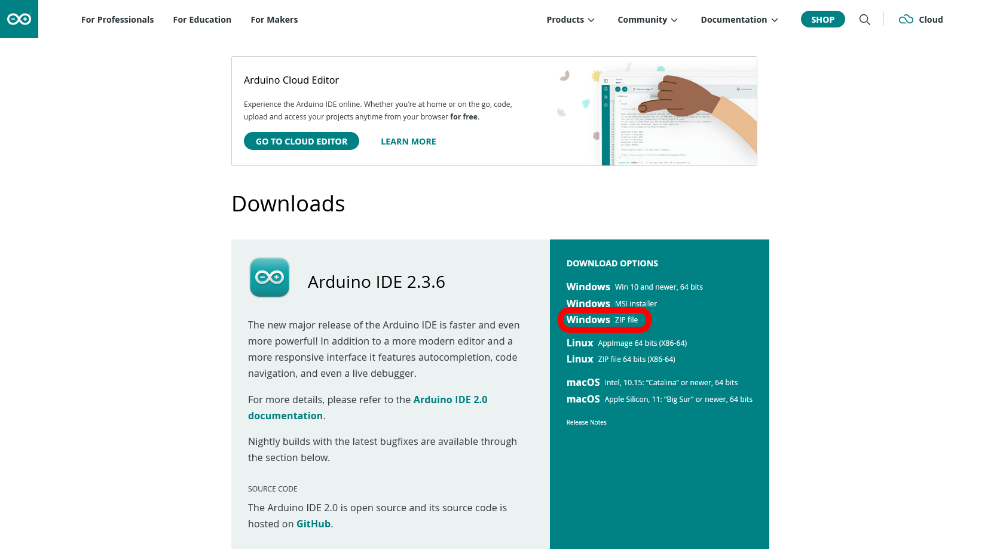

We use Windows ZIP files for non admin installation on computers we don't own, like school computers. However this version may still not work on all computers.

If the latest version works on your computer, great feel free to use it. It has a more modern look and gives a little more help if your code has any errors.

Otherwise, we're going to download and install version 1.8.18, which has worked on every Windows computer I've tried it on. Scroll down to the bottom of the page to [Previous Releases](https://www.arduino.cc/en/software/OldSoftwareReleases/) and download the ZIP file.

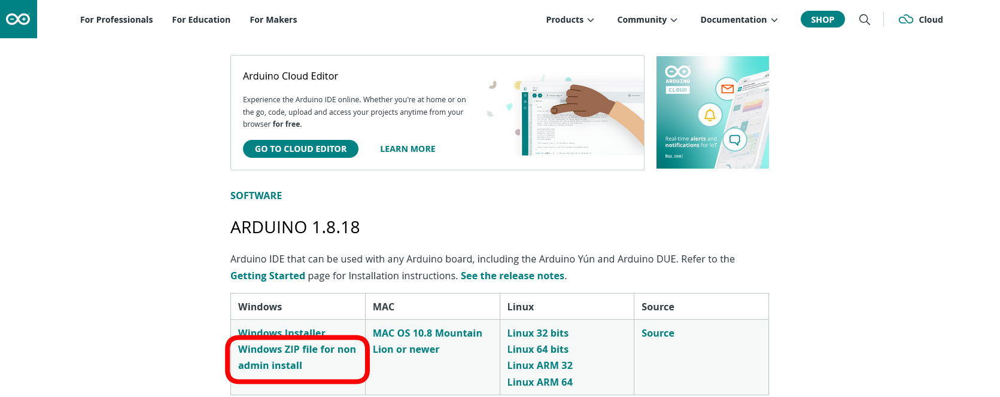

## Extracting Arduino IDE

Open the location where the ZIP file downloads (most likely the `Downloads` folder on your computer).
Extract using Windows tools by right clicking on the ZIP file and clicking `Extract all`.

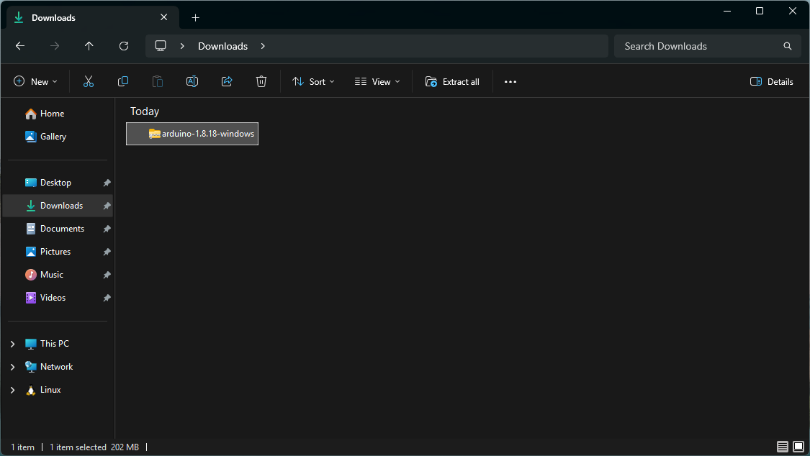

Be patient while it extracts...resist Instagram :face_exhaling:.  

The extracted folder should open automaticaly but if it doesn't, here's what it should look like next to the downloaded (unextracted) folder.

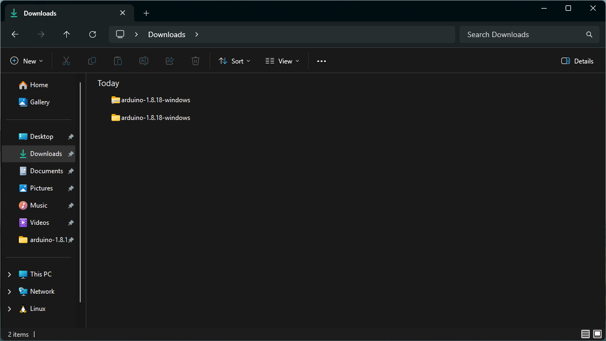

Open it and inside here, create a new folder called `portable`. 

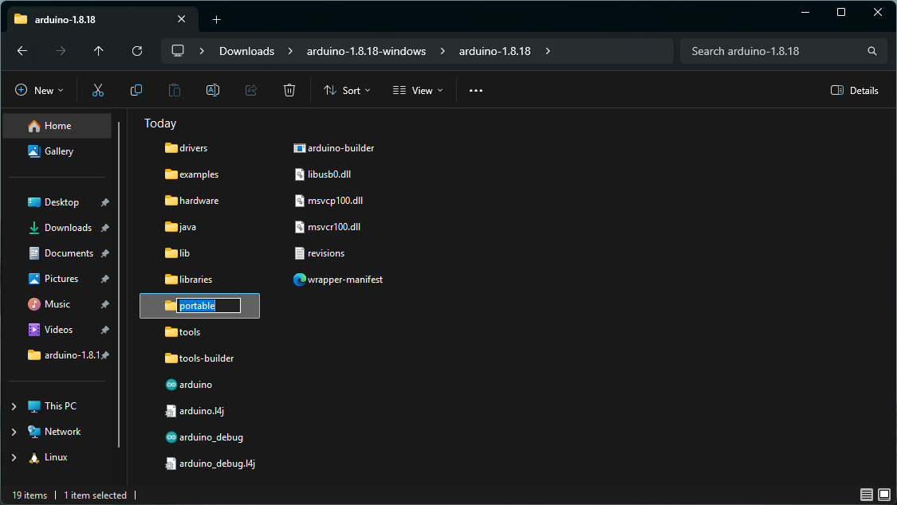

This tells Arduino IDE to save our sketches (files containing our code), settings and libraries here rather than elsewhere on the computer, where it may not save after logging out.

If you can, save the entire extracted folder onto a USB drive.
By doing this, you can carry your installation with you onto any other Windows computer and avoid repeating the tedious download and extract routine. 

## Arduino IDE

Plug the Arduino board to the computer via USB and open Arduino IDE by double clicking it's icon.

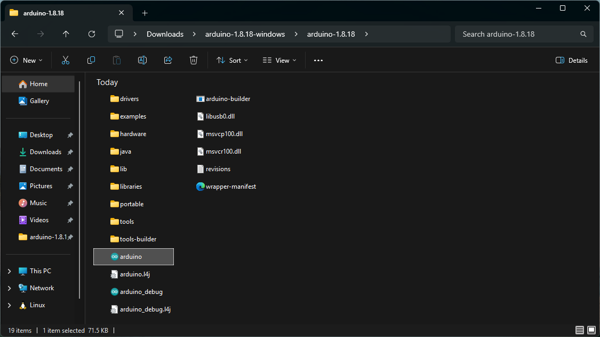

You'll see the familiar `setup()` and `loop()` functions. Resize the window if it's too small. Notice "Arduino Uno on COM3" in the bottom right, this means that the IDE has detected the board (Uno in our case) on COM port (a Windows name for USB port) 3 and is ready to upload. Check that yours says something similar.

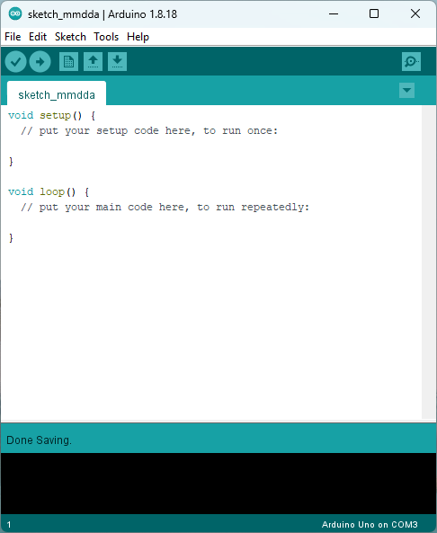

### Check COM Port

To check that the IDE has detected the board, under the Tools tab, check that "Port" shows the board. If it doesn't, check the USB connection. This is important as our code cannot be uploaded to the board if this is not correct. 

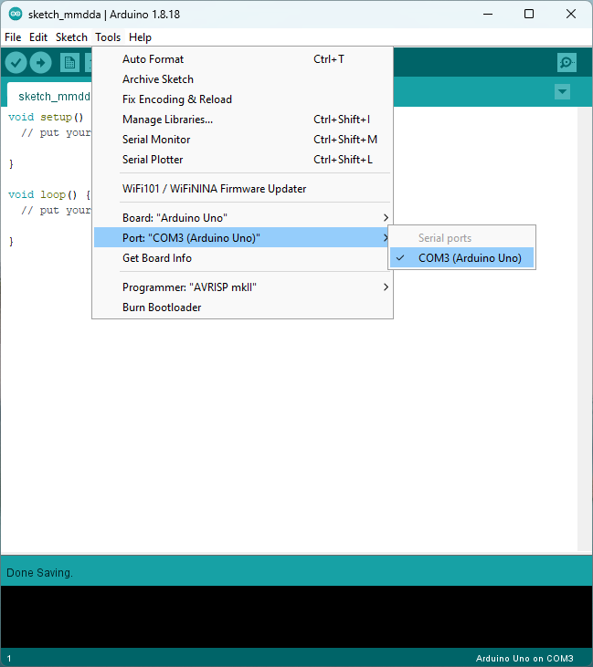

### Uploading First program

We're going to test the connection by uploading the same builtin blink code from Tinkercad. Again, in the case of the official Arduino Uno, the built in LED is located just under port 13. Select all the standard code in the IDE and delete it, we're about to replace it.

Right click [01-blink_builtin.ino](Code/01-blink_builtin.ino) and open in a new tab. Select all the code (`Ctrl + A`), copy it (`Ctrl + C`), paste it (`Ctrl + V`) it into the IDE and click `Verify`. The IDE will likely ask you to save the sketch, rename it "01-blink_builtin" and save. It should save it in `portable` > `sketchbook` along with any `libaries` used (don't worry about this).

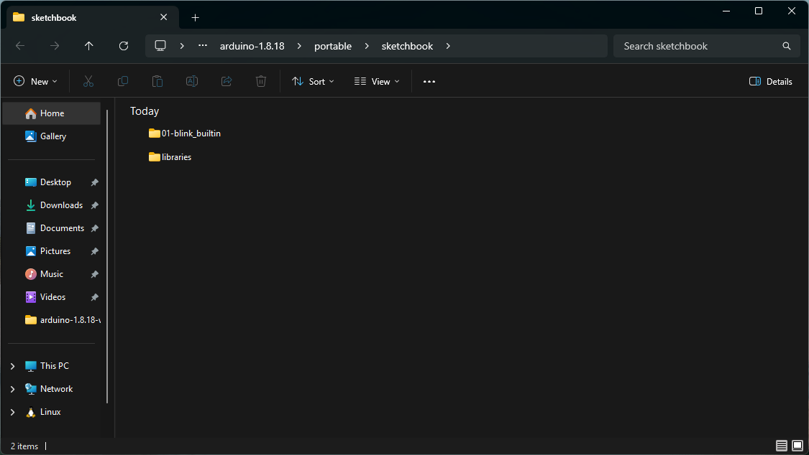

If there's no errors in the code, a message at the bottom should appear saying "Done compiling" along with how much memory was used. 

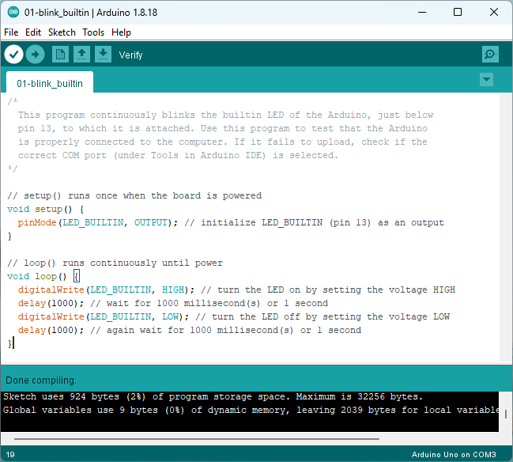

Just to see what happens, let's introduce an error by commenting out the very last `}`. 

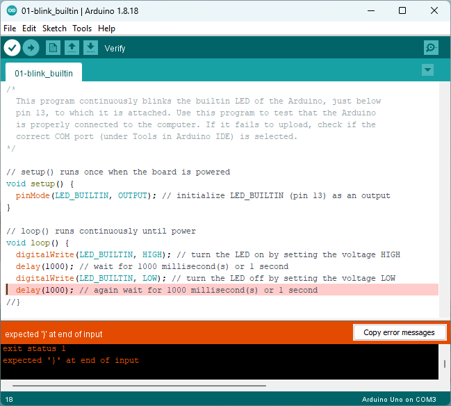

Similar to Tinkercad, the compiler returns an error and some information about it. OK, remove the error by uncommenting the very last `}`. Now click `Upload`, this compiles the code (verifies it) and if there are no errors, uploads the code onto the Arduino board. You can just click 'Upload' when finished writing code but it's a good habit to compile your code regularly to catch errors early. 

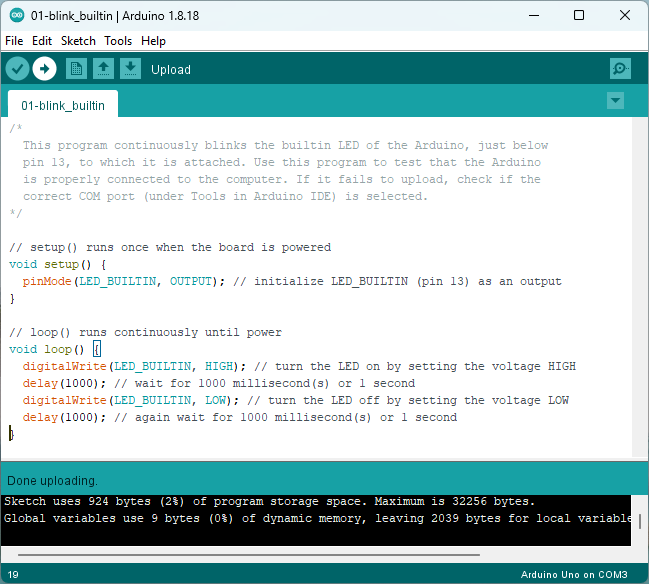

The LED on the actual Arduino Uno should now blink ON and OFF every second. If you succeeded, congratulations :partying_face:! We'll be building on this [next](10-blinking_led.md)!

Ideally save your entire `arduino-1.18.8-windows` folder onto a USB drive but at the very least, backup your `portable` folder before you log out of a computer that isn't yours!

If you can't save with a USB, try at least saving your `portable` folder to your phone, a cloud account or even attaching it to a draft email to save your sketches.

### Sketch Examples

 We won't need anymore for this intro, but I think some of the code examples that come along with the IDE are worth a little peek. 

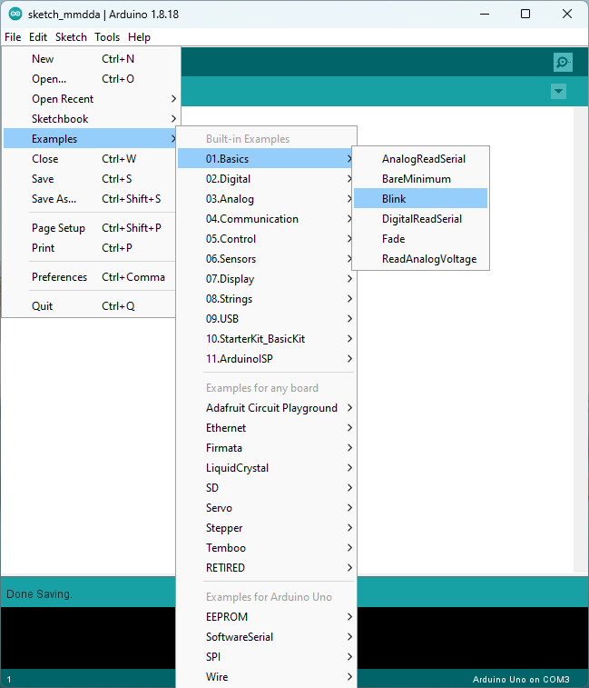

---

Next: [Building a blinking LED in hardware](10-blinking_led.md).
