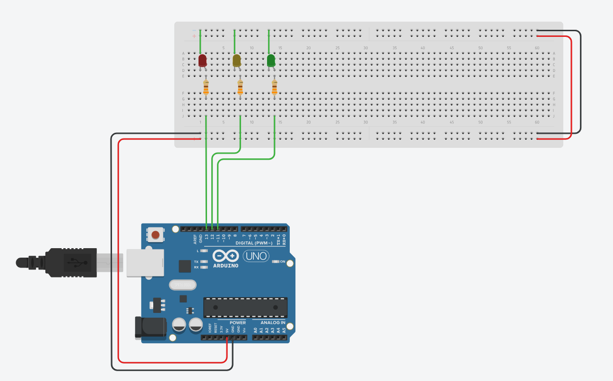

# Building Multiple Blinking LEDs



TLDR

Continuing from our single LED, we're now going to play with multiple LEDs and slowly build a simple traffic light system, with lights changing every 4 seconds, starting with green first. You could just build the above circuit in Tinkercad and/or physically and copy the [final code](Code/24-multiled_green_first.ino). 

However better practice would be building it in small steps and testing it as you go along. It leads to less errors, which in turn actually tends to be faster! For this circuit we'll start by adding [yellow](Code/20-multiled_yellow.ino) and [green](Code/21-multiled_green.ino) LEDs, adding another yellow light [transition](Code/22-multiled_yellow_transition.ino), changing [delays](Code/23-multiled_delays.ino) and finally changing light [order](Code/24-multiled_green_first.ino). 

---

TOC

- [Adding Yellow LED](#adding-yellow-led)
- [Adding Green LED](#adding-green-led)
- [Adding Another Yellow Transition](#adding-another-yellow-transition)
- [Changing Delays](#changing-delays)
- [Changing Sequence](#change-sequence)


## Adding Yellow LED

At this point, I would make a duplicate of the last circuit (blinking led) in Tinkercad and call it something like "20-multiled_yellow" before continuing.


We're going to add a yellow LED in the same way we did for our single red LED. We're going to just use the next available pin, 12 for our yellow LED.

In software, we need to do the following: 

- Declare our new yellow pin as a constant:  
`const int YELLOW = 12;`  

- Explicitly declare our yellow pin as an output in `void setup()`:  
`pinMode(YELLOW, OUTPUT);`  

- Tell it to blink after the red LED in `void loop()` by adding:  
`digitalWrite(YELLOW, HIGH);`  
`delay(1000);`  
`digitalWrite(YELLOW, LOW);`  
`delay(1000);`

To give the following:

```cpp
const int RED = 13;
const int YELLOW = 12;

void setup() {
  pinMode(RED, OUTPUT);
  pinMode(YELLOW, OUTPUT);
}

void loop() {
  digitalWrite(RED, HIGH);
  delay(1000);
  digitalWrite(RED, LOW);
  delay(1000);
  digitalWrite(YELLOW, HIGH);
  delay(1000);
  digitalWrite(YELLOW, LOW);
  delay(1000);
}
```

This circuit should now blink the red LED first then yellow repeatedly in a loop, until it runs out of power.

Get this working first in Tinkercad and then physically before going ahead.

## Adding Green LED

Suggestion: make a duplicate of the last circuit in Tinkercad and call it something like "21-multiled_green".


We repeat the same process again for a green LED connected to pin 11.

- Declare our new green pin as a constant:  
`const int GREEN = 11;`  

- Explicitly declare our green pin as an output in `void setup()`:  
`pinMode(GREEN, OUTPUT);`  

- Tell it to blink after the red and yellow LEDs in `void loop()`:  
`digitalWrite(GREEN, HIGH);`  
`delay(1000);`  
`digitalWrite(GREEN, LOW);`  
`delay(1000);`

To give the following:

```cpp
const int RED = 13;
const int YELLOW = 12;
const int GREEN = 11;

void setup() {
  pinMode(RED, OUTPUT);
  pinMode(YELLOW, OUTPUT);
  pinMode(GREEN, OUTPUT);
}

void loop() {
  digitalWrite(RED, HIGH);
  delay(1000);
  digitalWrite(RED, LOW);
  delay(1000);
  digitalWrite(YELLOW, HIGH);
  delay(1000);
  digitalWrite(YELLOW, LOW);
  delay(1000);
  digitalWrite(GREEN, HIGH);
  delay(1000);
  digitalWrite(GREEN, LOW);
  delay(1000);
}
```

The circuit should now blink the red LED first then yellow then green repeatedly in a loop.

Get this working first in Tinkercad and then physically before going ahead.

## Adding Another Yellow Transition

Suggestion: make a duplicate of the last circuit in Tinkercad and call it something like "22-multiled_yellow_transition" before continuing.

With our existing code, the LEDs will light red first, then yellow, then green then loop back and start again with red. To make our circuit resemble a real traffic light, we need to make the yellow LED also light up *after* the green and *before* the red.

We have the same blink code: 

```cpp
digitalWrite(YELLOW, HIGH);
delay(1000);
digitalWrite(YELLOW, LOW);
delay(1000);
```

We just need to insert it again into the right place (*after* the green and *before* the red). As our code loops back to red after green, we can just place our code snippet at the end.

```cpp
const int RED = 13;
const int YELLOW = 12;
const int GREEN = 11;

void setup() {
  pinMode(RED, OUTPUT);
  pinMode(YELLOW, OUTPUT);
  pinMode(GREEN, OUTPUT);
}

void loop() {
  digitalWrite(RED, HIGH);
  delay(1000);
  digitalWrite(RED, LOW);
  delay(1000);
  digitalWrite(YELLOW, HIGH);
  delay(1000);
  digitalWrite(YELLOW, LOW);
  delay(1000);
  digitalWrite(GREEN, HIGH);
  delay(1000);
  digitalWrite(GREEN, LOW);
  delay(1000);
  digitalWrite(YELLOW, HIGH);
  delay(1000);
  digitalWrite(YELLOW, LOW);
  delay(1000);
}
```

We should now have a light sequence of red, then yellow, then green, then yellow again, then back to the start with red.

Get this working first in Tinkercad and then physically before going ahead. 

## Changing Delays

Suggestion: make a duplicate of the last circuit in Tinkercad and call it something like "23-multiled_delays" before continuing.

Our current simplified traffic light system transitions between lights every 1 second. This is too quick, but then again we don't want to stare at long realistic sequences all day while testing our code. So let's change the time our lights stay on to 4 seconds.

We do that by only changeing our delays after HIGH (ON) mode in `void loop()`. Remember the `delay()` function works in milliseconds (ms) and 1000 ms = 1 second, so 4000 ms = 4 seconds.

Here's the relevant section of code:

```cpp
void loop() {
  digitalWrite(RED, HIGH);
  delay(4000);
  digitalWrite(RED, LOW);
  delay(1000);
  digitalWrite(YELLOW, HIGH);
  delay(4000);
  digitalWrite(YELLOW, LOW);
  delay(1000);
  digitalWrite(GREEN, HIGH);
  delay(4000);
  digitalWrite(GREEN, LOW);
  delay(1000);
  digitalWrite(YELLOW, HIGH);
  delay(4000);
  digitalWrite(YELLOW, LOW);
  delay(1000);
}
```

This works nicely, but it seems that the LOW (OFF) delays take too long. Rather than get rid of the OFF delays now, let's test getting rid of them first by commenting them out:

```cpp
void loop() {
  digitalWrite(RED, HIGH);
  delay(4000);
  digitalWrite(RED, LOW);
  //delay(1000);
  digitalWrite(YELLOW, HIGH);
  delay(4000);
  digitalWrite(YELLOW, LOW);
  //delay(1000);
  digitalWrite(GREEN, HIGH);
  delay(4000);
  digitalWrite(GREEN, LOW);
  //delay(1000);
  digitalWrite(YELLOW, HIGH);
  delay(4000);
  digitalWrite(YELLOW, LOW);
  //delay(1000);
}
```

Yeah let's get rid of the OFF delays to give:

```cpp
const int RED = 13;
const int YELLOW = 12;
const int GREEN = 11;

void setup() {
  pinMode(RED, OUTPUT);
  pinMode(YELLOW, OUTPUT);
  pinMode(GREEN, OUTPUT);
}

void loop() {
  digitalWrite(RED, HIGH);
  delay(4000);
  digitalWrite(RED, LOW);
  digitalWrite(YELLOW, HIGH);
  delay(4000);
  digitalWrite(YELLOW, LOW);
  digitalWrite(GREEN, HIGH);
  delay(4000);
  digitalWrite(GREEN, LOW);
  digitalWrite(YELLOW, HIGH);
  delay(4000);
  digitalWrite(YELLOW, LOW);
}
```

We should have the same light sequence but the lights are on for 4 seconds each and change much faster when turned OFF. This works much better now, see if you agree by getting this to work first in Tinkercad and then physically before going ahead.

## Change Sequence

Suggestion: make a duplicate of the last circuit in Tinkercad and call it something like "24-multiled_green_first" before continuing.

We're going to change the sequence of the lights to start with green first. The reason we're doing this is because in the next section we're going to add pedestrian lights and it would make our code easier to work with if our lights started with the green lights for cars on first. Trust me bro. Also we get to play around with our code. 

We want to select the bottom half of our code (split with a blank line) and move it to the top:

```cpp
void loop() {
  digitalWrite(RED, HIGH);
  delay(4000);
  digitalWrite(RED, LOW);
  digitalWrite(YELLOW, HIGH);
  delay(4000);
  digitalWrite(YELLOW, LOW);
  
  digitalWrite(GREEN, HIGH);
  delay(4000);
  digitalWrite(GREEN, LOW);
  digitalWrite(YELLOW, HIGH);
  delay(4000);
  digitalWrite(YELLOW, LOW);
}
```

Our code now becomes:

```cpp
const int RED = 13;
const int YELLOW = 12;
const int GREEN = 11;

void setup() {
  pinMode(RED, OUTPUT);
  pinMode(YELLOW, OUTPUT);
  pinMode(GREEN, OUTPUT);
}

void loop() {
  digitalWrite(GREEN, HIGH);
  delay(4000);
  digitalWrite(GREEN, LOW);
  digitalWrite(YELLOW, HIGH);
  delay(4000);
  digitalWrite(YELLOW, LOW);
  digitalWrite(RED, HIGH);
  delay(4000);
  digitalWrite(RED, LOW);
  digitalWrite(YELLOW, HIGH);
  delay(4000);
  digitalWrite(YELLOW, LOW);
}
```

This circuit is the same as the last one except that green starts first.

Get this working first in Tinkercad and then physically before going ahead.

You have a working traffic light now yay!

---

Next: [Adding pedestrian lights](30_traffic_led.md).
